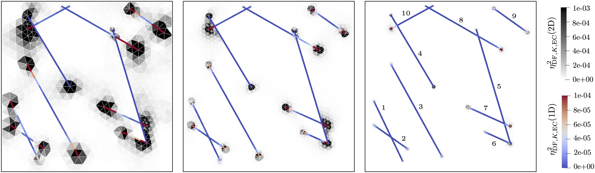

# mdestimates: *A posteriori* error estimates for mixed-dimensional elliptic equations

**mdestimates** is a Python package created for computing *a posteriori* error estimates for mixed-dimensional elliptic equations. That is, the set of equations that models the flow in fractured porous media. The package is build as an extension of [PorePy](https://github.com/pmgbergen/porepy). Note that **mdestimates** also relies on the numerical integration package [quadpy](https://github.com/nschloe/quadpy).

**Figure:** Diffusive-flux error estimates obtained with Multipoint Flux Approximation (MPFA) for three different refinement levels.

## Installation from source

**mdestimates** is developed under Python >= 3.8. Get the latest version by cloning this repository, i.e.:

    git clone https://github.com/jhabriel/mixdim-estimates.git
    cd mixdim-estimates
  
Now, install the dependencies:
 
     pip install -r requirements.txt
     
We require the development version of PorePy >= 1.4.1 to be installed. If you do not have PorePy installed, please [do so](https://github.com/pmgbergen/porepy/blob/develop/Install.md) before installing **mdestimates**.
 
To install **mdestimates**:

    pip install .

Or, for user-editable installations:

    pip install --editable .

## Getting started

A simple usage of **mdestimates** can be found in tutorials/basic_tutorial.ipynb.

## Examples

All the numerical examples included in the manuscript can be found in the **paper_examples** folder. These include two validation cases and two benchmark problems.

## Citing

If you use **mdestimates** in your research, we ask you to cite the following reference:

Varela, J., E. Ahmed, E. Keilegavlen, J. Nordbotten and F. A. Radu. “A posteriori error estimates for hierarchical mixed-dimensional elliptic equations.” (2021). arXiv preprint 2101.08331. 

## Problems, suggestions, enhancements...
Create an [issue](https://github.com/jhabriel/mixdim-estimates).

## License
See [license md](./LICENSE.md).
